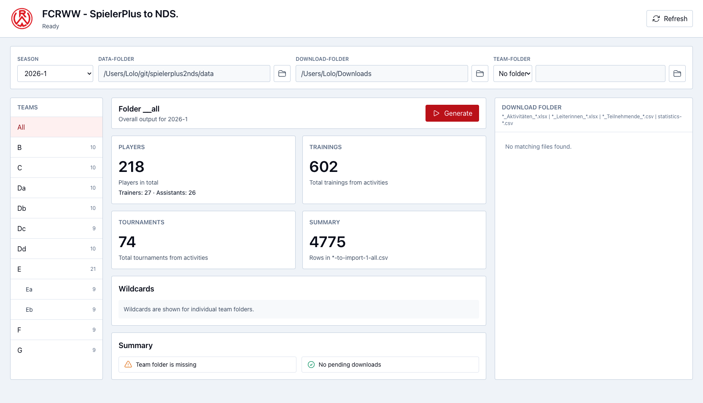
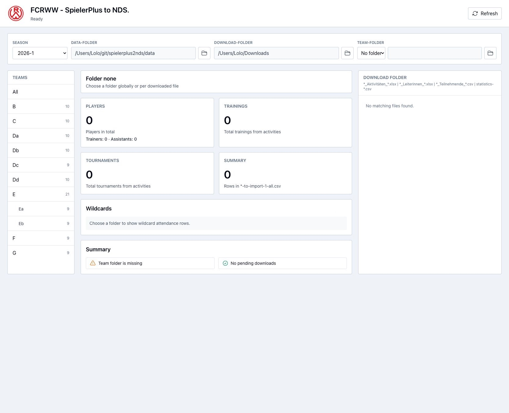
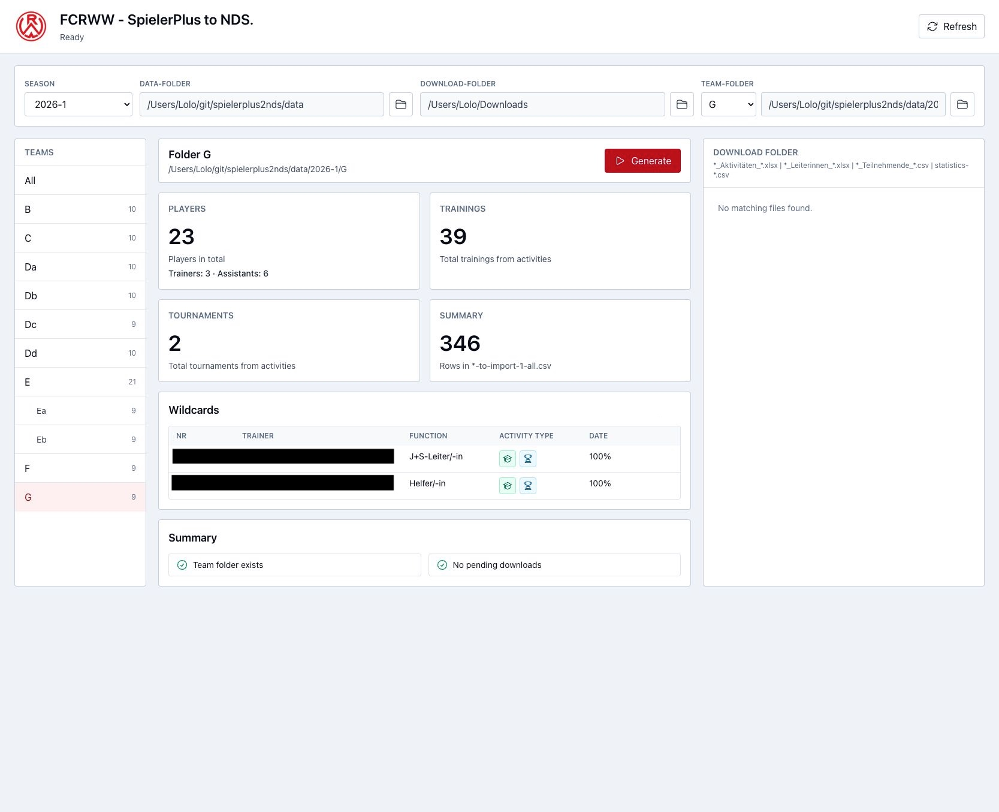
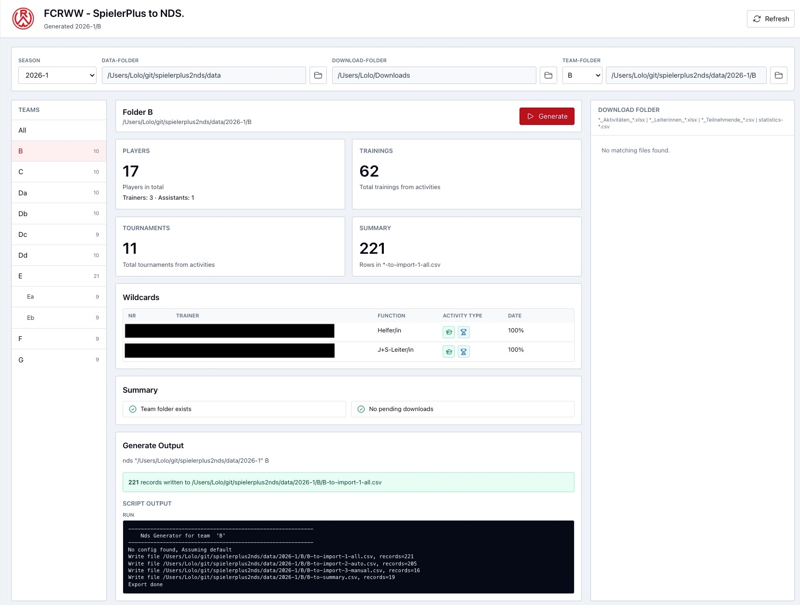

# FCRWW - SpielerPlus to NDS App

React/TypeScript frontend for moving SpielerPlus exports into the NDS data folders and reviewing generated import results.

## Requirements

- Node.js and npm
- Running API server from `spielerplus2nds-api` on `http://localhost:3001`
- Browser access to the local Vite app on `http://localhost:5173`
- Data folder available at `/Users/Lolo/git/spielerplus2nds/data`
- Download folder available at `/Users/Lolo/Downloads`

## Installation

```sh
npm install
```

## Run

```sh
npm run dev
```

Open `http://localhost:5173`.

## Build and lint

```sh
npm run build
npm run lint
```

## Features

- Season selector sorted by year and season, newest first.
- Top folder display for:
  - data folder
  - download folder
  - selected team folder
- Team navigation for `B`, `C`, `Da`, `Db`, `Dc`, `Dd`, `E`, `F`, `G`.
- Subteam display and selection from optional `config.json` files in team folders.
- `All` selection for overall generate output and aggregate metrics.
- Three-column desktop layout:
  - left: teams and subteams
  - middle: metrics, warnings, generate results
  - right: pending download files
- Pending download file list for:
  - `*_Aktivitäten_*.xlsx`
  - `*_Leiterinnen_*.xlsx`
  - `*_Teilnehmende_*.csv`
  - `statistics-*.csv`
- Import actions:
  - move a download file into the selected team or row-selected team
  - archive matching old files in `_archive`
  - reject `statistics-*.csv` imports into subteams
  - when `All` or no team is selected, require a row-level team selection
  - after import, run Generate for the imported team
  - when `All` is selected, also run Generate for All after the team generate
- Generate actions:
  - top-level team generate
  - All generate
  - no generate button for subteams; generated data for the parent team is shown instead
  - global lock during All generate to prevent imports, folder changes, and other generate actions
- Metrics shown without pressing Generate:
  - players total
  - J+S trainers
  - assistants marked as Helfer
  - trainings from activities
  - tournaments from activities
  - rows in `*-to-import-1-all.csv`
- Parent teams with subteams show aggregate counts.
- All counts sum top-level teams only to avoid double counting subteams.
- Wildcards display from `nds+anwesenheiten-always.csv`.
- Missing data box shown only when there are missing entries:
  - missing persons
  - missing or wrong events
  - missing trainers for an event
  - missing certifications
- Generate output box:
  - command
  - generated import record count
  - trainer conflicts
  - raw script output
- State keeps generate results when switching teams.
- Loading overlay in the middle column during workspace and season data loads.

## Snapshots

### All Dashboard

The All view shows aggregate metrics without pressing Generate. It also keeps the download import column available with row-level team selection when needed.



### Missing Data And Generate Output

After Generate, actionable missing data is shown in a separate `Missing` box above the generated script output.



### Team Metrics

Team views show folder-specific metrics, wildcards, and the selected team folder path.



## Application layout

The app is optimized for a wide desktop screen and uses a fixed three-column working layout below the top filter bar.

### Top filter bar

The top bar contains:

- FCRWW logo and app title
- current status message, for example `Ready` or `Loading 2025-2`
- Refresh action
- season selector
- read-only data folder display
- read-only download folder display
- team folder selector and read-only selected folder path

The season selector controls all team data and metrics. Counts are loaded immediately after the season changes; Generate is not required for the metric boxes.

### Left column: teams

The left column is the team navigation tree.

- `All` selects the overall view.
- Top-level teams are shown as normal rows.
- Subteams from `config.json` are shown indented below their parent.
- Clicking an already-selected team deselects it.
- Subteam selection shows the subteam folder, but Generate results are associated with the parent team.

The number on the right of each row is the number of files in that folder. For a parent team with subteams, the count includes the parent folder plus configured subteams.

See the left side of the All dashboard snapshot:


### Middle column: work area

The middle column is the primary work surface.

It contains:

- selected folder title and folder path
- Generate button for top-level teams and All
- metric boxes:
  - Players
  - Trainings
  - Tournaments
  - Summary
- Wildcards table from `nds+anwesenheiten-always.csv`
- Summary status box
- Missing box, only visible when missing entries exist
- Generate Output box, visible after Generate or a generate error

The middle column shows a loading overlay while season/team data is being loaded. During an All Generate, the app locks changes until the process finishes.

Team metric layout:



Missing and generated output layout:


### Right column: download queue

The right column shows matching files currently waiting in the download folder.

Supported pending download patterns:

- `*_Aktivitäten_*.xlsx`
- `*_Leiterinnen_*.xlsx`
- `*_Teilnehmende_*.csv`
- `statistics-*.csv`

Each row shows:

- file icon
- filename
- size and modified timestamp
- optional row-level team selector
- Import action

The row-level team selector is shown when:

- no team is selected
- `All` is selected

`All` is never a valid import target. If `All` is selected, the imported row's chosen team is used for the move and the first Generate run. After that team Generate completes, All Generate runs too.

`statistics-*.csv` files can only be imported into top-level teams.

## Preconditions

- The API must have permission to read `/Users/Lolo/git/spielerplus2nds/data`.
- The API must have permission to watch and move files from `/Users/Lolo/Downloads`.
- The NDS script must exist at `/Users/Lolo/git/spielerplus2nds/nds.sh`.
- Team folders must exist under the selected season, for example:

```text
/Users/Lolo/git/spielerplus2nds/data/2026-1/G
```

## Configuration

The frontend reads configuration from the API `GET /config` endpoint.

By default the API URL is:

```text
http://localhost:3001
```

To override it, set:

```sh
VITE_API_URL=http://localhost:3001
```

## Notes

- The native browser folder picker is optional and only changes the displayed folder label in the current UI.
- File moving and data generation are done by the API, not by the browser.
- The UI intentionally keeps generated missing-data state locally so rows can be removed from the current view without editing files.
